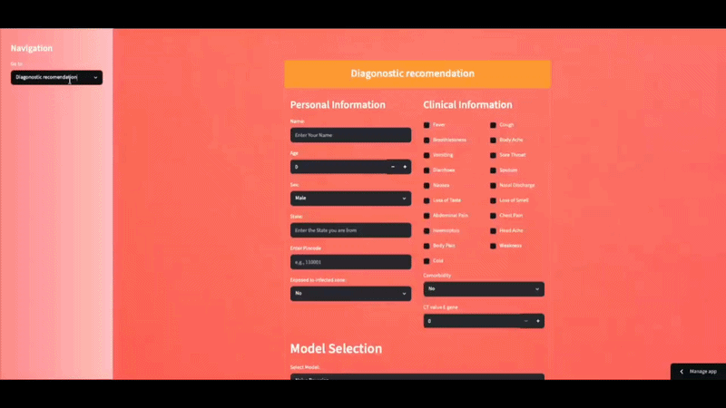

# COVID-19 Screening System 🌡️

A web-based application to detect COVID-19 using demographic data, symptoms, and RT-PCR parameters, powered by Streamlit and machine learning models. Developed to assist healthcare professionals and individuals in early screening and risk assessment.
## 📖 Overview
This project is a user-friendly COVID-19 Screening System designed to predict the likelihood of COVID-19 infection based on:

Demographic Data: Age, gender, and premedical conditions.
Symptoms: Fever, cough, breathlessness, and more (19 symptoms total).
RT-PCR Parameters: E-gene CT value.

The application leverages machine learning models, including Naive Bayes, Logistic Regression, Decision Tree, Random Forest, and SVM (Linear, RBF, Sigmoid), to provide diagnostic recommendations. It features an interactive Streamlit interface with navigation for screening, risk assessment, and primary treatment guidance.
## ✨ Features

Interactive UI: Input personal data, select symptoms via checkboxes, and choose from multiple ML models for predictions.
Multi-Model Predictions: Compare results from Naive Bayes, Logistic Regression, Decision Tree, Random Forest, and SVM variants.
Data Visualization: Displays input data in a structured table for clarity.
Navigation: Sidebar with options for Screening Tool, Risk Assessment, and Primary Treatment.
Custom Styling: Colorful, responsive design with HTML/CSS enhancements for a professional look.
## 🎥 Demo

## 📋 Requirements

Python 3.8+
Streamlit
Pandas
Scikit-learn
Pickle
Base64

See requirements.txt for the full list of dependencies.
## 🚀 Usage

Enter Personal Data: Input your name, age, gender, premedical condition, and E-gene CT value in the "Personal and Clinical Data" panel.
Select Symptoms: Check relevant symptoms from the provided list in the "Symptoms Selection" panel.
Choose a Model: Select a machine learning model from the dropdown (e.g., Naive Bayes, SVM).
Get Predictions: Click "Make Predictions" to view the diagnostic result ("You Have COVID-19" or "You Don't Have COVID-19").
Navigate Sections: Use the sidebar to explore Screening Tool, Risk Assessment, or Primary Treatment.

## 📊 Project Structure
Covid_screeing_application/
├── content/              # Model files (e.g., bayes.pkl, logistic.pkl)
├── requirements.txt      # Python dependencies
├── updated_my_streamlit_app.py  # Main Streamlit application
└── README.md             # Project documentation

## 🤝 Contributing
Contributions are welcome! To contribute:

Fork the repository.
Create a new branch (git checkout -b feature-branch).
Make your changes and commit (git commit -m "Add feature").
Push to the branch (git push origin feature-branch).
Open a Pull Request.

## 📧 Contact
For questions or feedback, reach out to Sumit Nayek:
Email: sumitnayek1998@gmail.com
GitHub: Sumit-Nayek
Portfolio: View Experience

## 🙏 Acknowledgments

Funded by the Indian Council of Medical Research (ICMR).
Built with ❤️ using Streamlit and Scikit-learn.

© 2025 Sumit Nayek
